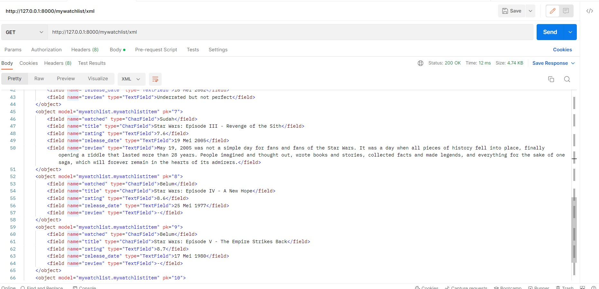

Tugas 2
1. 
    Django menggunakan request dan respon object untuk berkomunikasi antara klien dan server.

    URL digunakan untuk mengarahkan permintaan HTTP klien lalu meneruskannya ke views

    views adalah business logic yang menerima permintaan HTTP dan mengembalikan respon HTTP. View mengakses data yang dibutuhkan untuk memenuhi "request" melalui models dan memformat "response" ke templat

    models adalah objek yang membentuk struktur data dari sebuah aplikasi, dan sebagai perantara dari view dan database

    template adalah "text file" yang membentuk struktur atau layout dari file. Template mengubah script data yang diterima dari view agar bisa ditampilkan pada layar user.

2. Virtual environment memberikan ruang yang terpisah untuk membuat aplikasi yang diinginkan dari sistem operasi. Kita bisa menginstall berbagai macam hal khusus untuk projek yang kita inginkan dan tidak mempengaruhi sistem operasi atau projek lainnya

3. Pada views.py terdapat fungsi show_katalog fungsi ini mendefinisikan berbagai macam benda yang diambil dari models.py agar bisa dilanjutkan ke HTML

    data di views.py dirouting menggunakan file bernama urls.py. Setelah menerima request dari pengguna maka routing berfungsi untuk mengarahkan request ke aplikasi yang benar.  Pada urls.py pada folder katalog terdapat variable yang mendefinisikan routing aplikasi tersebut. Lalu pada urls.py di folder project_django aplikasi tadi akan diarahkan dengan path ''

    Pada file templates bernama katalog.html, yang menggunakan html, data dari views akan diproses disini menjadi tampilan yang diinginkan kepada pengguna

    Untuk di deploy ke HEROKU project akan di push ke repository di GitHub. Karena file penunjang untuk mendeploy heroku sudah lengkap tinggal kita buat link aplikasinya di heroku lalu mendeploy repositori di GitHub ke link aplikasi yang sudah dibuat di heroku.

Link : https://tugas2-bimo-h.herokuapp.com/

Tugas 3
1. Jelaskan perbedaan antara JSON, XML, dan HTML!
    HTML menampilkan data dan menggambarkan struktur halaman webnya dan merupakan markup language
    XML menyimpan dan mengirim data dan merupakan markup language
    JSON menyimpan dan mengirim data dalam bahasa javascript

2. Karena dalam web ada komunikasi antara client dan server yang tentu saja perlu untuk menstransfer data

TANDA SAMA DENGAN(=) ARTINYA PEMBATAS
3.  1.  menjalankan perintah =python manage.py startapp mywatchlist=
    2.  dalam file settings.py dalam folder urls dalam folder project_django dalam variable installed apps ditambahkan nama apps mywatchlist. lalu dalam file urls di folder project_django, dalam variable url_path tambahkan =path('katalog/', include('katalog.urls'))=
    3. dalam file models.py di folder mywatchlist ditambahkan function =MyWatchlistItem(models.Model):= dengan jenis item dan data typenya
    4. membuat file initial_mywatchlist_data.json pada folder fixtures untuk menyimpan 10 data yang dibutuhkan
    5. dala file views.py di folder mywatchlist ditambahkan function =def show_html(request):= untuk html, function =def show_json(request)= untuk json dan function =def show_xml(request):= untuk xml
    6. pada file urls.py di folder mywatchlist tambahkan urlpatterns dengan isinya =path('html/', show_html, name='show_html')= untuk merouting web yang html, =path('json/', show_json, name='show_json')= untuk merouting web yang json, =path('xml/', show_xml, name='show_xml')= untuk merouting web yang xml
    7. karena menggunakan tugas2 yang sudah dideploy minggu lalu, tugas tiga tinggal men-push ke github dan akan otomatis dideploy
    8. sisanya readme aja

4. Screenshoot:

5.  Link    
    https://tugas2-bimo-h.herokuapp.com/mywatchlist/html/
    https://tugas2-bimo-h.herokuapp.com/mywatchlist/xml/
    https://tugas2-bimo-h.herokuapp.com/mywatchlist/json/

Tugas 4
1.   digunakan untuk mencegah serangan cyber berupa crsf attack
    Jika tidak ada  maka halaman akan error 

2. Kita bisa membuat elemen form secara manual. Menggunakan Dajango Templates engine, kita bisa membuat form secara manual bahkan bisa lebih baik.
    menggunakan html outpot private method
    1. Mengumpulkan eror yang tidak terhubung dengan field yang spesifil dan error dari hidden fields
    2. Menaruh non field error dan hidden field error di tempat paling atas
    3. Iterasi seluruh form fields
    4. Merender form fields satu persatu

3.  1. Menerima data dari user lalu melekatkannya ke forum
    2. clean dan memvalidasi data
    3. jika data invalid tampilkan ulang form atau error
    4. jika data valid lakukan langkah selanjutnya sesuai dari code yang ditulis
    5. setelah selesai pindahkan user ke url lain, salah satunya menampilkan data form

4.  1. menjalankan perintah python manage.py startapp di terminal
    2.  membuat file urls.py dan menambahkan script sesuai yang ada di urls.py
    3. dalam models.py membuat Class Task dan menambahkan model-model yang dibutuhkan
    4. dalam views.py membuat method register, login_user, logout_user. lalu membuat html sesuai dengan method dan membuat urlnya di urls.py
    5. membuat form user menjadi seperti ini     user = models.ForeignKey(User,on_delete=models.CASCADE, related_name="user_todolist", null=True), lalu pada html untuk mengambil data menggunakan script user.user_todolist.all

Tugas 5
1.  Inline CSS adalah kode CSS yang ditulis langsung pada atribut elemen HTML. Setiap elemen HTML memiliki atribut style, di situ lah inline CSS ditulis.
        kelebihan:
            Sangat membantu ketika Anda hanya ingin menguji dan melihat perubahan pada satu elemen.
            Berguna untuk memperbaiki kode dengan cepat.
            Proses permintaan HTTP yang lebih kecil dan proses load website akan lebih cepat.
        kekurangan:
            Tidak efisien karena Inline style CSS hanya bisa diterapkan pada satu elemen HTML

    Internal CSS adalah kode CSS yang ditulis di dalam tag <style> dan kode HTML dituliskan di bagian atas (header) file HTML. Internal CSS dapat digunakan untuk membuat tampilan pada satu halaman website dan tidak digunakan pada halaman website yang lain.
        kelebihan:
            Perubahan pada Internal CSS hanya berlaku pada satu halaman saja.
            Anda tidak perlu melakukan upload beberapa file karena HTML dan CSS berada dalam satu file.
            Class dan ID bisa digunakan oleh internal stylesheet.
        kekurangan:
            Tidak efisien apabila Anda ingin menggunakan CSS yang sama dalam beberapa file.
            Membuat performa website lebih lemot. Sebab, CSS yang berbeda-beda akan mengakibatkan loading ulang setiap kali Anda ganti halaman website

    Eksternal CSS adalah kode CSS yang ditulis terpisah dengan kode HTML Eksternal CSS ditulis di sebuah file khusus yang berekstensi .css. File eksternal CSS biasanya diletakkan setelah bagian <head> pada halaman
        kelebihan:
            Ukuran file HTML akan menjadi lebih kecil dan struktur dari kode HTML jadi lebih rapi.
            Loading website menjadi lebih cepat.
            File CSS dapat digunakan di beberapa halaman website sekaligus
        kekurangan:
            Halaman akan menjadi berantakan, ketika file CSS gagal dipanggil oleh file HTML. Hal ini terjadi disebabkan karena koneksi internet yang lambat

2.  <!--...--> = comment
    <!DOCTYPE> = tipe dokumen
    <a> = link
    <b> = bold text
      = single line break
    <button> = tombol
    
 = divition
    <form> = form user input
    <h1> to <h6> = heading
    <html> = HTML document root
    <nav> = navigation links
    <section> = section
    <style> = informasi style untuk document
    <table> = table

3.  .class = menunjuk element dengan class="class"
    #id = menunjuk element dengan id="id"
    * = memilih semua elemen
    element = memilih semua elemen <element>

4.  1.  halaman register, login, dan create task mendapat inspirasi dari https://mdbootstrap.com/docs/standard/extended/login/#section-7. untuk halaman todolist menggunakan card dari boostrap
    2.  menggunakan boostrap halaman dibuat responsive sesuai size dari halaman contoh script: 

    3.  ketika hover dibuat file css terpisah dan ditambahkan :hover pada pointer

